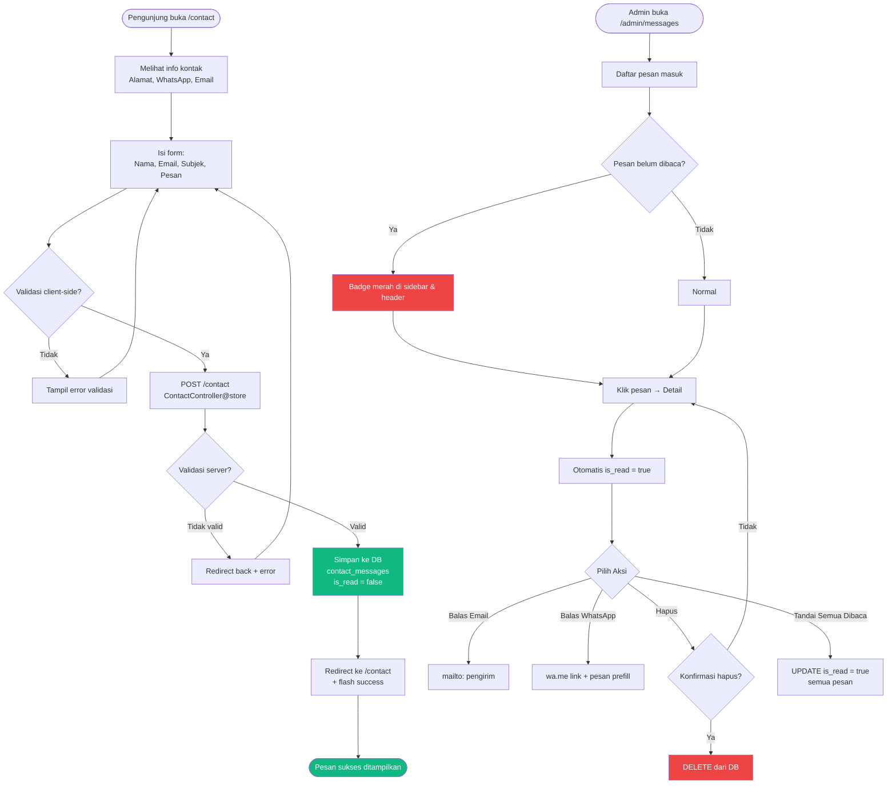
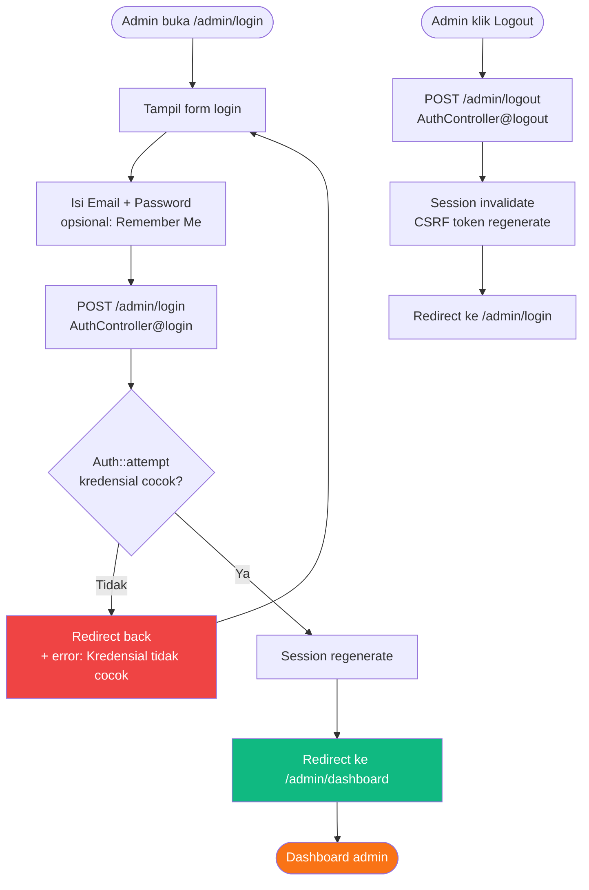
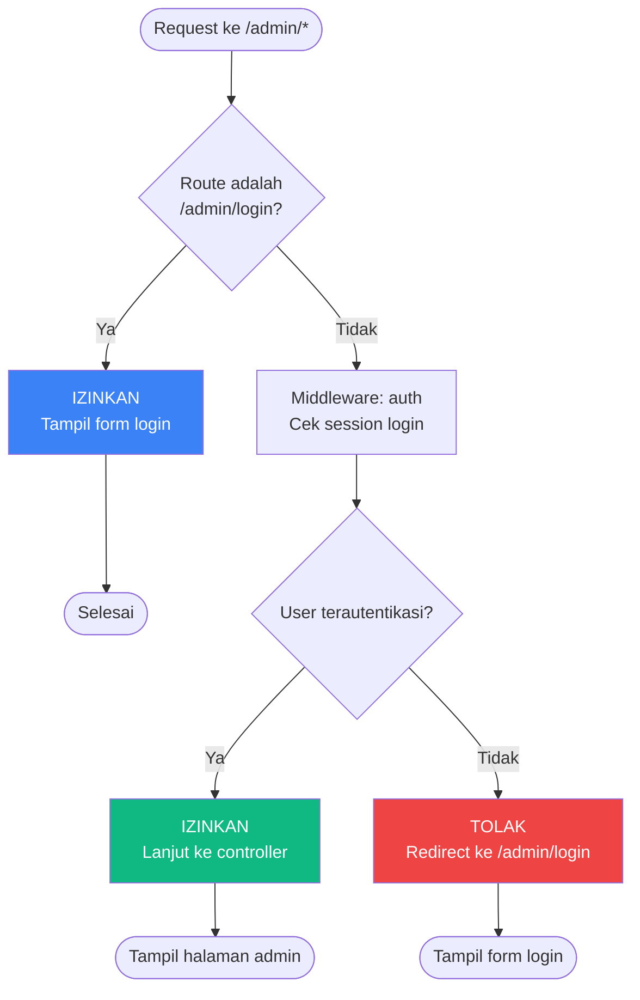

# 📊 Flowchart Sistem — Website Desa Pengrajin Genteng Dure

> Dokumen ini berisi flowchart dalam format **Mermaid.js** yang dapat langsung di-render menjadi gambar menggunakan ChatGPT atau tools Mermaid lainnya.

---

## 1. Flowchart Utama — Sitemap & Navigasi

```mermaid
flowchart TB
    START([Pengunjung Buka Website]) --> HOME[/ Beranda]

    HOME --> |Lihat Produk| CATALOG[/catalog Katalog Produk]
    HOME --> |Hubungi Kami| CONTACT[/contact Hubungi Kami]
    HOME --> |Lihat Sejarah| HISTORY[/history Sejarah Desa]

    CATALOG --> |Filter/Kategori| CATALOG
    CATALOG --> |Order WhatsApp| WA[wa.me Link]
    CATALOG --> |Kembali| HOME

    CONTACT --> |Isi Form & Kirim| SUBMIT[POST /contact]
    SUBMIT --> |Berhasil| SUCCESS[Tampil Notifikasi Sukses]
    CONTACT --> |Chat WhatsApp| WA

    HISTORY --> |Lihat Produk| CATALOG
    HISTORY --> |Hubungi Kami| CONTACT

    ADMIN_LOGIN[/admin/login] --> |Autentikasi| DASHBOARD[/admin/dashboard]

    DASHBOARD --> PRODUCTS[/admin/products]
    DASHBOARD --> CRAFTSMEN[/admin/craftsmen]
    DASHBOARD --> GALLERY[/admin/gallery]
    DASHBOARD --> MESSAGES[/admin/messages]
    DASHBOARD --> PROFILE[/admin/profile]
    DASHBOARD --> SETTINGS[/admin/settings]

    style START fill:#f97316,color:#fff
    style SUCCESS fill:#10b981,color:#fff
    style WA fill:#25d366,color:#fff
```

---

## 2. Flowchart — Pengiriman Pesan Kontak (Frontend → Backend)



---

## 3. Flowchart — Autentikasi Admin (Login & Logout)



---

## 4. Flowchart — Dashboard Admin

```mermaid
flowchart TD
    A([Admin login berhasil]) --> B[/admin/dashboard\nDashboardController@index]

    B --> C[Query data dari DB]
    C --> D[productsCount = COUNT products]
    C --> E[craftsmenCount = COUNT craftsmen]
    C --> F[galleriesCount = COUNT galleries]
    C --> G[unreadMessages = COUNT contact_messages WHERE is_read=false]
    C --> H[recentProducts = 5 produk terbaru]
    C --> I[recentMessages = 5 pesan terbaru]
    C --> J[categories = GROUP BY category + COUNT]

    B --> K[Tampil Dashboard]

    K --> L[4 Stat Cards:\nProduk | Pengrajin | Galeri | Pesan Baru]
    K --> M[Quick Actions:\n+ Produk | + Pengrajin | + Galeri | Lihat Pesan]
    K --> N[Produk Terbaru\n5 item terakhir]
    K --> O[Kategori Produk\nprogress bar per kategori]
    K --> P[Pesan Masuk Terbaru\n5 pesan terakhir]

    L --> |Klik| Q1[/admin/products]
    L --> |Klik| Q2[/admin/craftsmen]
    L --> |Klik| Q3[/admin/gallery]
    L --> |Klik| Q4[/admin/messages]
    M --> |Klik| R1[/admin/products/create]
    M --> |Klik| R2[/admin/craftsmen/create]
    M --> |Klik| R3[/admin/gallery/create]
    M --> |Klik| R4[/admin/messages]
    P --> |Klik pesan| S[/admin/messages/{id}]

    style K fill:#f97316,color:#fff
```

---

## 5. Flowchart — CRUD Produk

```mermaid
flowchart TD
    A([Admin buka /admin/products]) --> B[Tampil daftar produk]

    B --> C{Pilih Aksi}
    C -->|Tambah| D[GET /admin/products/create]
    D --> E[Tampil form tambah]
    E --> F[Isi: name, price, category, description, image, wa]
    F --> G[POST /admin/products\nProductController@store]
    G --> H{Validasi?}
    H -->|Tidak| I[Tampil error validasi]
    I --> E
    H -->|Ya| J[Upload foto ke storage/app/public/products/]
    J --> K[Simpan ke DB]
    K --> L[Redirect ke index + flash sukses]

    C -->|Edit| M[GET /admin/products/{id}/edit]
    M --> N[Tampil form edit\data terisi]
    N --> O[Ubah data + upload foto baru opsional]
    O --> P[PUT /admin/products/{id}\nProductController@update]
    P --> Q{Validasi?}
    Q -->|Tidak| R[Tampil error validasi]
    R --> N
    Q -->|Ya| S{Ada foto baru?}
    S -->|Ya| T[Hapus foto lama dari storage\nUpload foto baru]
    S -->|Tidak| U[Update data tanpa ganti foto]
    T --> V[Update DB]
    U --> V
    V --> W[Redirect ke index + flash sukses]

    C -->|Hapus| X[Klik tombol hapus]
    X --> Y{Konfirmasi hapus?}
    Y -->|Tidak| B
    Y -->|Ya| Z[DELETE /admin/products/{id}\nProductController@destroy]
    Z --> AA[Hapus foto dari storage]
    AA --> AB[Hapus record dari DB]
    AB --> AC[Redirect ke index + flash sukses]

    style K fill:#10b981,color:#fff
    style V fill:#10b981,color:#fff
    style AB fill:#ef4444,color:#fff
    style L fill:#3b82f6,color:#fff
    style W fill:#3b82f6,color:#fff
    style AC fill:#3b82f6,color:#fff
```

---

## 6. Flowchart — CRUD Pengrajin

```mermaid
flowchart TD
    A([Admin buka /admin/craftsmen]) --> B[Tampil daftar pengrajin]

    B --> C{Pilih Aksi}
    C -->|Tambah| D[GET /admin/craftsmen/create]
    D --> E[Tampil form tambah]
    E --> F[Isi: name, role, image, quote]
    F --> G[POST /admin/craftsmen\nCraftsmanController@store]
    G --> H{Validasi?}
    H -->|Tidak| I[Tampil error validasi]
    I --> E
    H -->|Ya| J[Upload foto ke storage/app/public/craftsmen/]
    J --> K[Simpan ke DB]
    K --> L[Redirect ke index + flash sukses]

    C -->|Edit| M[GET /admin/craftsmen/{id}/edit]
    M --> N[Tampil form edit\ndata terisi]
    N --> O[Ubah data + upload foto baru opsional]
    O --> P[PUT /admin/craftsmen/{id}\nCraftsmanController@update]
    P --> Q{Validasi?}
    Q -->|Tidak| R[Tampil error validasi]
    R --> N
    Q -->|Ya| S{Ada foto baru?}
    S -->|Ya| T[Hapus foto lama\nUpload foto baru]
    S -->|Tidak| U[Update data tanpa ganti foto]
    T --> V[Update DB]
    U --> V
    V --> W[Redirect ke index + flash sukses]

    C -->|Hapus| X[Klik tombol hapus]
    X --> Y{Konfirmasi hapus?}
    Y -->|Tidak| B
    Y -->|Ya| Z[DELETE /admin/craftsmen/{id}\nCraftsmanController@destroy]
    Z --> AA[Hapus foto dari storage]
    AA --> AB[Hapus record dari DB]
    AB --> AC[Redirect ke index + flash sukses]

    style K fill:#10b981,color:#fff
    style V fill:#10b981,color:#fff
    style AB fill:#ef4444,color:#fff
    style L fill:#3b82f6,color:#fff
    style W fill:#3b82f6,color:#fff
    style AC fill:#3b82f6,color:#fff
```

---

## 7. Flowchart — CRUD Galeri

```mermaid
flowchart TD
    A([Admin buka /admin/gallery]) --> B[Tampil daftar galeri foto]

    B --> C{Pilih Aksi}
    C -->|Tambah| D[GET /admin/gallery/create]
    D --> E[Tampil form tambah]
    E --> F[Isi: title, category, url foto]
    F --> G[POST /admin/gallery\nGalleryController@store]
    G --> H{Validasi?}
    H -->|Tidak| I[Tampil error validasi]
    I --> E
    H -->|Ya| J[Upload foto ke storage/app/public/gallery/]
    J --> K[Simpan ke DB]
    K --> L[Redirect ke index + flash sukses]

    C -->|Edit| M[GET /admin/gallery/{id}/edit]
    M --> N[Tampil form edit\ndata terisi]
    N --> O[Ubah data + upload foto baru opsional]
    O --> P[PUT /admin/gallery/{id}\nGalleryController@update]
    P --> Q{Validasi?}
    Q -->|Tidak| R[Tampil error validasi]
    R --> N
    Q -->|Ya| S{Ada foto baru?}
    S -->|Ya| T[Hapus foto lama\nUpload foto baru]
    S -->|Tidak| U[Update data tanpa ganti foto]
    T --> V[Update DB]
    U --> V
    V --> W[Redirect ke index + flash sukses]

    C -->|Hapus| X[Klik tombol hapus]
    X --> Y{Konfirmasi hapus?}
    Y -->|Tidak| B
    Y -->|Ya| Z[DELETE /admin/gallery/{id}\nGalleryController@destroy]
    Z --> AA[Hapus foto dari storage]
    AA --> AB[Hapus record dari DB]
    AB --> AC[Redirect ke index + flash sukses]

    style K fill:#10b981,color:#fff
    style V fill:#10b981,color:#fff
    style AB fill:#ef4444,color:#fff
    style L fill:#3b82f6,color:#fff
    style W fill:#3b82f6,color:#fff
    style AC fill:#3b82f6,color:#fff
```

---

## 8. Flowchart — Manajemen Pesan Masuk

```mermaid
flowchart TD
    A([Admin buka /admin/messages]) --> B[ContactMessageController@index\nquery filter: ?filter=all|unread|read]

    B --> C[Daftar pesan masuk\nurut ID desc]
    C --> D{Pesan belum dibaca?}
    D -->|Ya| E[Badge merah di sidebar + header\n+ highlight border pada kartu pesan]
    D -->|Tidak| F[Kartu pesan normal]

    C --> G{Pilih Aksi}

    G -->|Filter| H[Klik tab: Semua | Belum Dibaca | Sudah Dibaca]
    H --> I[GET /admin/messages?filter=xxx]
    I --> C

    G -->|Lihat Detail| J[Klik pesan\nGET /admin/messages/{id}]
    J --> K[Tampil detail: nama, email, subjek, pesan, waktu]
    J --> L[UPDATE is_read = true\notomatis saat dibuka]

    K --> M{Pilih Aksi di Detail}
    M -->|Balas Email| N[mailto:email pengirim]
    M -->|Balas WhatsApp| O[wa.me link + pesan prefill]
    M -->|Hapus| P{Konfirmasi hapus?}
    P -->|Ya| Q[DELETE /admin/messages/{id}\nhapus record dari DB]
    P -->|Tidak| K
    Q --> R[Redirect ke index + flash sukses]

    G -->|Tandai Semua Dibaca| S[POST /admin/messages/mark-all-read]
    S --> T[UPDATE semua is_read = true]
    T --> U[Redirect ke index + flash sukses]

    G -->|Hapus| V[Klik tombol hapus pada daftar]
    V --> W{Konfirmasi hapus?}
    W -->|Ya| Q
    W -->|Tidak| C

    style E fill:#ef4444,color:#fff
    style L fill:#10b981,color:#fff
    style Q fill:#ef4444,color:#fff
    style T fill:#10b981,color:#fff
```

---

## 9. Flowchart — Profil Admin (Ubah Nama & Password)

```mermaid
flowchart TD
    A([Admin buka /admin/profile]) --> B[Tampil halaman profil]

    B --> C{Pilih Aksi}

    C -->|Ubah Nama| D[Isi field nama baru]
    D --> E[POST /admin/profile/name\nProfileController@updateName]
    E --> F{Validasi?\nname: required, max:255}
    F -->|Tidak| G[Tampil error validasi]
    G --> B
    F -->|Ya| H[UPDATE users SET name = input]
    H --> I[Redirect ke /admin/profile\n+ flash: Nama berhasil diperbarui]

    C -->|Ubah Password| J[Isi: current_password, password, password_confirmation]
    J --> K[POST /admin/profile/password\nProfileController@updatePassword]
    K --> L{Validasi?\npassword: required, min:8, confirmed]
    L -->|Tidak| M[Tampil error validasi]
    M --> B
    L -->|Ya| N{Hash::check\ncurrent_password cocok?}
    N -->|Tidak| O[Error: Password saat ini tidak sesuai]
    O --> B
    N -->|Ya| P[UPDATE users SET password = bcrypt(input)]
    P --> Q[Redirect ke /admin/profile\n+ flash: Password berhasil diperbarui]

    style I fill:#10b981,color:#fff
    style Q fill:#10b981,color:#fff
    style O fill:#ef4444,color:#fff
    style G fill:#ef4444,color:#fff
```

---

## 10. Flowchart — Pengaturan Website

```mermaid
flowchart TD
    A([Admin buka /admin/settings]) --> B[SettingController@index]
    B --> C[Query semua settings\ngroupBy group]
    C --> D[Tampil form pengaturan\ndikelompokkan per grup]

    D --> E[Admin edit field pengaturan]

    E --> F{Grup yang diedit?}

    F -->|Hero & Beranda| G[Edit: hero_title, hero_subtitle,\nhero_cta_primary, hero_cta_secondary,\nstat_families, stat_products, stat_years,\nabout_title, quote_text]
    F -->|Kontak| H[Edit: contact_address, contact_whatsapp,\ncontact_email, contact_hours_weekday,\ncontact_hours_weekend]

    G --> I[Klik Simpan Pengaturan]
    H --> I

    I --> J[PUT /admin/settings\nSettingController@update]
    J --> K{Validasi data?}
    K -->|Tidak| L[Tampil error validasi]
    L --> D
    K -->|Ya| M[Loop setiap key → value]
    M --> N[Setting::updateOrCreate key => value]
    N --> O[Redirect ke /admin/settings\n+ flash: Pengaturan berhasil disimpan]

    style O fill:#10b981,color:#fff
    style L fill:#ef4444,color:#fff
```

---

## 11. Flowchart — Katalog Produk (Frontend Pengunjung)

```mermaid
flowchart TD
    A([Pengunjung buka /catalog]) --> B[CatalogController@index]
    B --> C[Query semua produk\nurut ID desc]
    C --> D[Query distinct categories\nuntuk filter tabs]
    D --> E[Tampil katalog produk + filter]

    E --> F{Pengunjung pilih aksi}

    F -->|Filter Kategori| G[Klik tab kategori]
    G --> H[Update URL: ?category=xxx\nJS: filter produk real-time]

    F -->|Pencarian| I[Ketik di search box]
    I --> J[Debounce 500ms]
    J --> K[Update URL: ?search=xxx\nJS: filter produk real-time]

    F -->|Kombinasi| L[?category=xxx&search=yyy]
    L --> M[Filter produk berdasarkan\nkategori + search]

    H --> N{Ada hasil?}
    K --> N
    M --> N
    N -->|Ya| O[Tampil grid produk\n1 kolom → 2 kolom → 3 kolom]
    N -->|Tidak| P[Tampil empty state\n"Tidak Ada Produk" + tombol reset]

    O --> Q[Klik tombol WhatsApp\npada kartu produk]
    Q --> R[Redirect ke wa.me/{product.wa}]

    P --> S[Klik "Lihat Semua Produk"]
    S --> A

    style O fill:#10b981,color:#fff
    style P fill:#ef4444,color:#fff
    style R fill:#25d366,color:#fff
```

---

## 12. Flowchart — Alur Umum Upload Gambar (CRUD Produk/Pengrajin/Galeri)

```mermaid
flowchart TD
    A([Admin submit form dengan foto]) --> B{Validasi gambar?}

    B -->|Tidak| C[Tampil error validasi\nformat: jpeg, png, jpg, webp\nmax: 2MB]
    C --> D[Kembali ke form + error]

    B -->|Ya| E{Operasi: Create atau Update?}

    E -->|Create| F[Upload file ke storage/app/public/{folder}]
    F --> G[Simpan path relatif ke DB\ncontoh: products/xxx.jpg]
    G --> H[Redirect + flash sukses]

    E -->|Update| I{Ada file baru diupload?}
    I -->|Ya| J[Hapus file lama dari storage]
    J --> K[Upload file baru ke storage/app/public/{folder}]
    K --> L[Update path relatif di DB]
    L --> M[Redirect + flash sukses]

    I -->|Tidak| N[Update data tanpa ganti foto]
    N --> M

    O([Admin hapus record]) --> P[Hapus file dari storage\njika file ada]
    P --> Q[Hapus record dari DB]
    Q --> R[Redirect + flash sukses]

    style H fill:#10b981,color:#fff
    style M fill:#10b981,color:#fff
    style R fill:#3b82f6,color:#fff
    style C fill:#ef4444,color:#fff
```

---

## 13. Flowchart — Middleware Proteksi Admin



---

## 14. Flowchart — Alur Data Keseluruhan Sistem

```mermaid
flowchart LR
    subgraph Frontend[Frontend — Pengunjung]
        HOME[Beranda /]
        CATALOG[Katalog /catalog]
        HISTORY[Sejarah /history]
        CONTACT[Kontak /contact]
    end

    subgraph Backend[Backend — Admin Panel]
        LOGIN[Login /admin/login]
        DASH[Dashboard /admin/dashboard]
        PROD[Produk /admin/products]
        CRAFT[Pengrajin /admin/craftsmen]
        GALL[Galeri /admin/gallery]
        MSG[Pesan /admin/messages]
        PROF[Profil /admin/profile]
        SETT[Pengaturan /admin/settings]
    end

    subgraph DB[(Database MySQL)]
        TB_PRODUCTS[products]
        TB_CRAFTSMEN[craftsmen]
        TB_GALLERIES[galleries]
        TB_MESSAGES[contact_messages]
        TB_SETTINGS[settings]
        TB_USERS[users]
    end

    HOME -->|3 produk terbaru| TB_PRODUCTS
    HOME -->|2 pengrajin terbaru| TB_CRAFTSMEN
    HOME -->|semua galeri| TB_GALLERIES
    HOME -->|konten hero & stat| TB_SETTINGS
    CATALOG -->|semua produk + filter| TB_PRODUCTS
    CONTACT -->|POST kirim pesan| TB_MESSAGES

    LOGIN -->|auth| TB_USERS
    DASH -->|stat counter| TB_PRODUCTS
    DASH -->|stat counter| TB_CRAFTSMEN
    DASH -->|stat counter| TB_GALLERIES
    DASH -->|unread count| TB_MESSAGES
    DASH -->|5 terbaru| TB_PRODUCTS
    DASH -->|5 terbaru| TB_MESSAGES
    DASH -->|group by category| TB_PRODUCTS

    PROD <-->|CRUD| TB_PRODUCTS
    CRAFT <-->|CRUD| TB_CRAFTSMEN
    GALL <-->|CRUD| TB_GALLERIES
    MSG <-->|Read + Delete| TB_MESSAGES
    PROF <-->|Update name/password| TB_USERS
    SETT <-->|Read + Update| TB_SETTINGS

    style Frontend fill:#fef3c7,stroke:#f59e0b,color:#92400e
    style Backend fill:#e0e7ff,stroke:#6366f1,color:#3730a3
    style DB fill:#f0fdf4,stroke:#22c55e,color:#166534
```